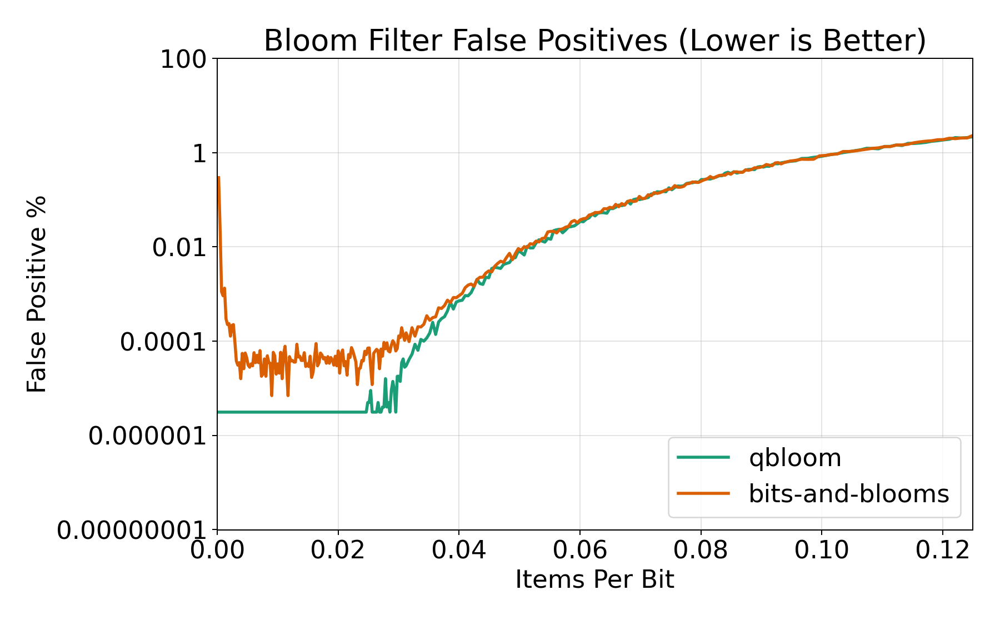

# qbloom: very fast bloom filter for go

A fast bloom filter that is based on the [fastbloom](https://github.com/tomtomwombat/fastbloom) implementation in Rust. The general speed-up comes from only requiring a single hash per item as compared to multiple in regular implementations. The optimizations are based on [this](https://www.eecs.harvard.edu/~michaelm/postscripts/rsa2008.pdf) paper. In addition, this implementation provides an atomic bloom filter that supports concurrent writes without relying on a mutex as compared to many other bloom filters.

## Benchmark results

Comparison benchmarks against [bits-and-blooms](https://github.com/bits-and-blooms/bloom) live in the isolated module at `benchmarks/bits-and-blooms`. For the parallel benchmarks, `bits-and-blooms` does not provide a thread-safe filter, so the comparison wraps it with a `sync.Mutex`.


| Benchmark | qbloom | bits-and-blooms | Speedup |
| --- | ---: | ---: | ---: |
| String test-and-add | 7.165 ns/op | 33.98 ns/op | 4.74x |
| String contains | 6.056 ns/op | 22.65 ns/op | 3.74x |
| Bytes test-and-add | 7.423 ns/op | 32.48 ns/op | 4.38x |
| Bytes contains | 6.433 ns/op | 22.08 ns/op | 3.43x |
| Atomic parallel string add | 33.92 ns/op | 200.9 ns/op | 5.92x |
| Atomic parallel string contains | 1.282 ns/op | 120.4 ns/op | 93.92x |
| Atomic parallel bytes add | 37.00 ns/op | 207.4 ns/op | 5.61x |
| Atomic parallel bytes contains | 1.348 ns/op | 123.2 ns/op | 91.39x |

## Accuracy

`qbloom` stays aligned with `bits-and-blooms` on false-positive rate even though it does less work per operation. The chart below follows the same kind of setup as `bench-bloom-filters`: fixed-size 4096-bit filters, a sweep over items per bit, the optimal hash count recomputed at each point, and the final line averaged across 16 trials with adaptive false-positive probing.

The two lines track very closely across the sweep, which suggests the speedup is not coming from a meaningful false-positive-rate tradeoff. Early `qbloom` points with zero observed false positives are shown at the run's detection floor so they remain visible on the log-scale chart.



Reproduce the accuracy data and graph:

```sh
cd benchmarks/bits-and-blooms
go run ./cmd/falseposcmp -out-dir Acc
python3 -m venv .venv
.venv/bin/pip install matplotlib
.venv/bin/python plot_falsepos.py Acc/qbloom.csv Acc/bits-and-blooms.csv false_positive_rate.png
```
