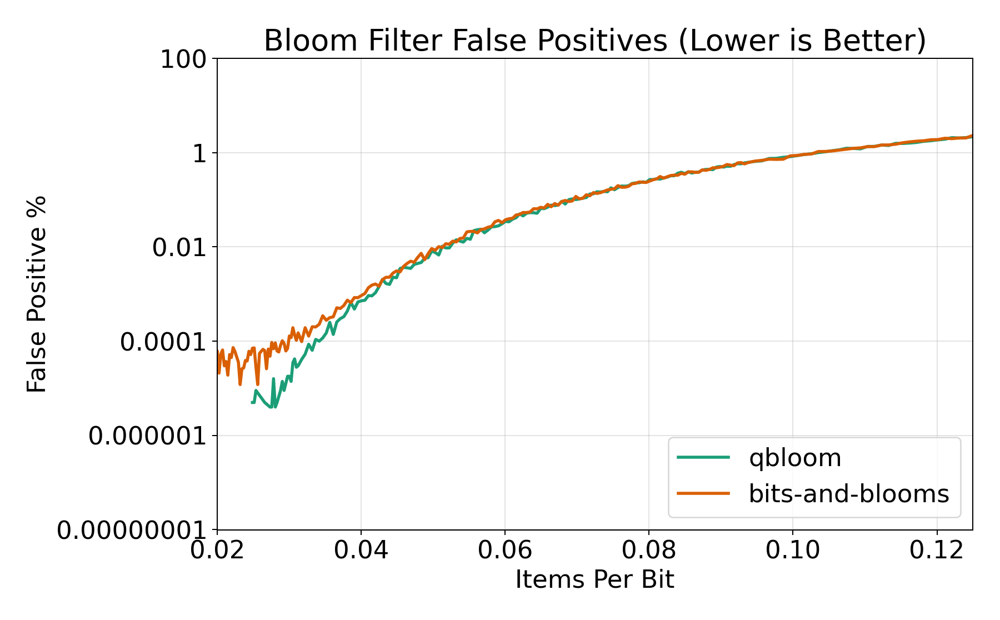

# qbloom: very fast bloom filter for go

A fast bloom filter that is based on the [fastbloom](https://github.com/tomtomwombat/fastbloom) implementation in Rust. The general speed-up comes from only requiring a single hash per item as compared to multiple in regular implementations. The optimizations are based on [this](https://www.eecs.harvard.edu/~michaelm/postscripts/rsa2008.pdf) paper. In addition, this implementation provides an atomic bloom filter that supports concurrent writes without relying on a mutex as compared to many other bloom filters.

The main idea is that `qbloom` does not compute `k` separate full hashes for every insert or lookup. It hashes the input once with `xxh3`, uses that as the first bit position, and then derives the remaining positions with a cheap recurrence in registers instead of rehashing the original bytes each time. The filter still checks or sets the same number of bits as a conventional Bloom filter, but most of the work moves from repeated hashing to simple integer operations. Bit indices are also mapped with the high half of a 64-bit multiply instead of a modulo, which avoids a division on the hot path.

The storage layout is just a slice of 64-bit words, so each derived index becomes one word load and one bit mask operation. The atomic variant keeps the same layout but replaces plain word updates with atomic `Or` operations on those 64-bit words, which allows concurrent inserts without a global lock. That is why the implementation can be substantially faster while still tracking the same false-positive behavior as more traditional Bloom filters when the bit budget and hash count are matched.

## Benchmark results

The table compares `qbloom` against [bits-and-blooms](https://github.com/bits-and-blooms/bloom) with matched bit counts and hash counts so the work is directly comparable.

The single-threaded rows measure two things: a combined lookup-and-insert path (`test-and-add`) and a read-only membership check (`contains`), each for both strings and byte slices. The parallel rows compare `qbloom`'s atomic filter against a mutex-protected `bits-and-blooms` filter, since `bits-and-blooms` does not provide a concurrent variant of its own.


| Benchmark | qbloom | bits-and-blooms | Speedup |
| --- | ---: | ---: | ---: |
| String test-and-add | 7.165 ns/op | 33.98 ns/op | 4.74x |
| String contains | 6.056 ns/op | 22.65 ns/op | 3.74x |
| Bytes test-and-add | 7.423 ns/op | 32.48 ns/op | 4.38x |
| Bytes contains | 6.433 ns/op | 22.08 ns/op | 3.43x |
| Atomic parallel string add | 33.92 ns/op | 200.9 ns/op | 5.92x |
| Atomic parallel string contains | 1.282 ns/op | 120.4 ns/op | 93.92x |
| Atomic parallel bytes add | 37.00 ns/op | 207.4 ns/op | 5.61x |
| Atomic parallel bytes contains | 1.348 ns/op | 123.2 ns/op | 91.39x |

## Accuracy

`qbloom` stays aligned with `bits-and-blooms` on false-positive rate even though it does less work per operation.

The chart uses fixed-size 4096-bit filters and sweeps the load from low occupancy to `0.125` items per bit. At each x-axis point both implementations are rebuilt for that exact load, given the same bit budget, and configured with the hash count that is optimal for the current number of inserted items. Each plotted value is then averaged across 16 independent trials.

For every trial, one set of values is inserted into the filter and a disjoint set of non-members is used for false-positive checks. The y-axis is logarithmic because the interesting part of the comparison spans several orders of magnitude, from near-zero false-positive rates at low occupancy to much higher rates as the filter fills up.

The two lines track very closely across the sweep, which suggests the speedup is not coming from a meaningful false-positive-rate tradeoff. The plotted image is cropped to the `0.02` to `0.125` items-per-bit range to focus on the most readable part of the curve. Points with zero observed false positives are omitted on the log-scale chart because a log axis cannot represent zero.



Reproduce the accuracy data and graph:

```sh
cd benchmarks
go run ./cmd/falseposcmp -out-dir Acc
python3 -m venv .venv
.venv/bin/pip install matplotlib
.venv/bin/python plot_falsepos.py Acc/qbloom.csv Acc/bits-and-blooms.csv false_positive_rate.png
```
